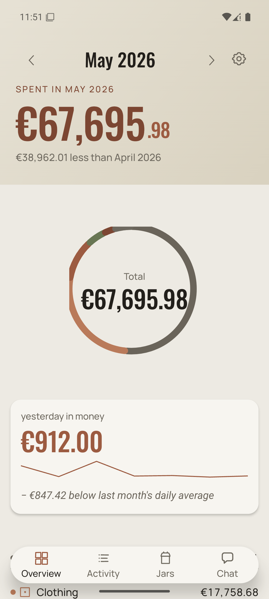
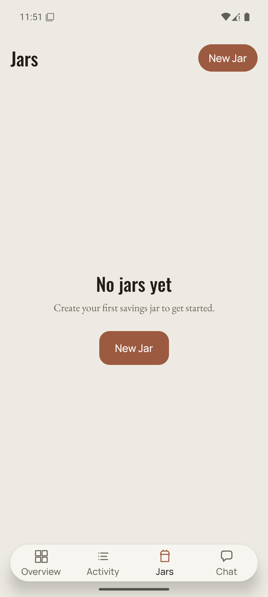
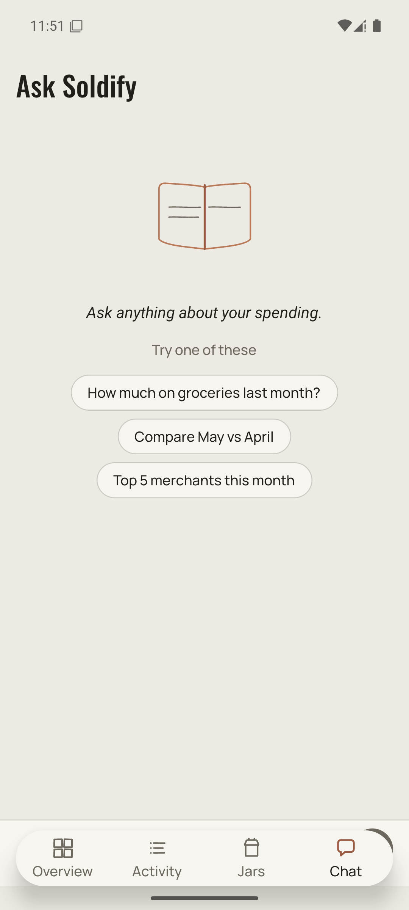
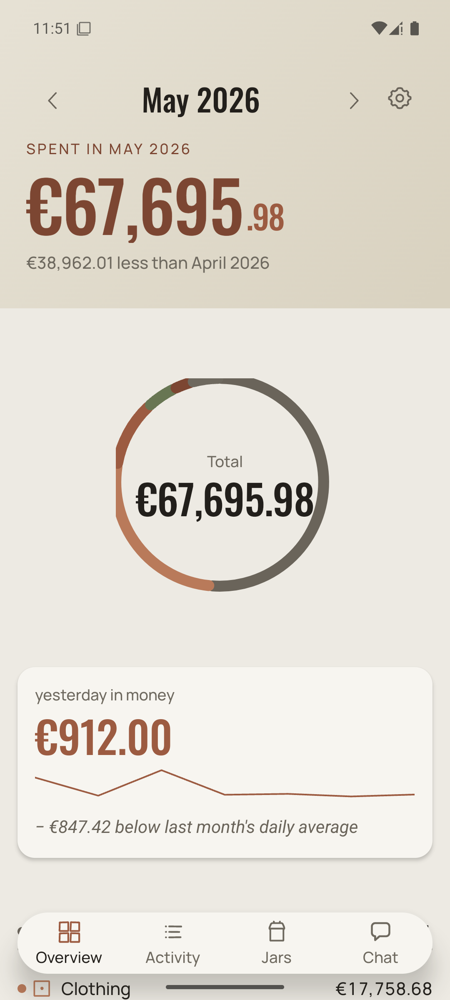
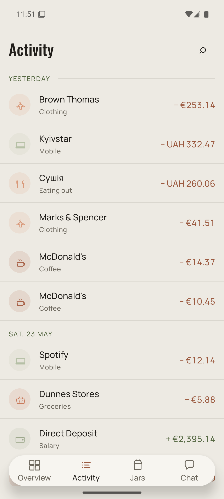

# Reply to Claude Design — v2: D-series shipped + UAT bugs cleared

> D1-D5 landed. UAT on Android emulator-5556 surfaced four bugs (1 P0, 2 P1, 1 P2). All four fixed and verified before this handoff. Live app screenshots below.
> 9 commits ahead of `origin/main` — held back from push until you sign off on this round.

---

## Status by D-slice

| ID  | Commit    | What                                                  | UAT verdict |
| --- | --------- | ----------------------------------------------------- | ----------- |
| D1  | `fb7ea5a` | i18n `chat:`/`ai:` separator → dot                    | ✅ ships    |
| D2  | `a3b4fb3` | ChatIcon asymmetric speech bubble                     | ✅ ships    |
| D3  | `ff962e4` | Dashboard gear: safe-area + larger hitSlop            | ✅ ships    |
| D4  | `055017c` | Dashboard hero band — split number + delta subline    | ✅ ships (one wrap bug, fixed post-UAT) |
| D5  | `ae1b984` | SourceTile onboarding badges (4 line icons)           | ⚠ not on-device yet (need `pm clear`) |

D6/D7/D8 from the v1 reply (Activity pills / Chat header port / leftover P2) — **not started yet**, on deck this session pending your review of v2.

---

## Where we are — live app, Android 15 (Pixel-class emulator)

> Screenshots are from a fresh dev-client install, JS hot-loaded from Metro on the latest `main` (`4e14812`). All four tabs render, cross-tab navigation no longer crashes, donut center label fits on one line.

### 1. Overview (Dashboard) — D4 hero verified



**Verified visually:**
- Hero band: warm sandstone gradient, month pill + chevrons + gear, `SPENT IN MAY 2026` eyebrow in moss-text.
- Split number: `€67,695` Oswald large + `.98` Oswald small. Reads like the HTML mock.
- Delta subline: `€38,962.01 less than April 2026` in moss-text.
- Donut centre: `Total / €67,695.98` on **one line** (post-fix — see Bug #2 below).
- Yesterday-in-money card: `€912.00` accent-deep + minor sparkline + `−€847.42 below last month's daily average`.
- Tab bar: 4 destinations, Overview selected (accent-deep icon + label underline).

### 2. Activity — survives forward+back navigation, title says "Activity"


**Verified visually:**
- In-body title reads **Activity** (matches tab label, was "Transactions" — fixed in `4e14812`).
- `YESTERDAY` and `SAT, 23 MAY` eyebrows + hairline separators.
- Token-clean rows: icon-badge circle + merchant (Oswald), category (moss-text muted), amount accent-deep right-aligned.
- Tabular-num alignment holds even across mixed currencies (€, UAH).
- Safe-area top inset clear — status bar no longer overlaps the Oswald header (was bug, fixed in `cec816e`).
- Crash loop on re-mount gone (was P0, fixed in `a2474ca` — see below).

### 3. Jars — empty state clean, accent-deep CTA



**Verified visually:**
- "Jars" Oswald title top-left + "New Jar" accent-deep pill top-right.
- Centred `No jars yet` Oswald 30pt + Garamond subline + accent-deep `New Jar` CTA.
- Safe-area top inset clear (same fix as Activity).
- Tab bar: Jars selected, jar icon glyph in accent-deep.

### 4. Chat — empty state with book glyph + suggestion pills



**Verified visually:**
- `Ask Soldify` Oswald header (safe-area inset clear).
- Hand-drawn open-book glyph in accent-deep — matches your D-spec illustration brief.
- Garamond italic intro: *Ask anything about your spending.*
- 3 outlined suggestion pills (manrope) — copy from D1 namespace fix.
- Tab bar: Chat selected with the **asymmetric speech bubble** glyph from D2.

### 5/6. Round-trip — no zombie state




**Verified:** Activity → Jars → Chat → Overview → Activity re-renders identically every time. The infinite-loop bug is gone in repeat-mount, not just first-mount.

---

## Bugs UAT surfaced — and what I shipped to clear them

### P0 — Activity tab infinite re-render → "Maximum update depth exceeded"

**Symptom on emulator-5556:** Activity tab rendered once (lucky first-paint snapshot), then crashed to the dev-launcher error overlay on any subsequent navigation back. Cascade then took down Jars and Chat tabs (blank renders).

**Root cause:** Two call sites — `app/(tabs)/transactions.tsx:45` and `src/features/transactions/FilterPillsRow.tsx:31` — selected from the Zustand filter store via an inline object literal **without shallow equality**. Each render returned a fresh reference, `useSyncExternalStore` saw a new snapshot every commit, React tripped the depth guard.

**Fix — commit `a2474ca`:** Wrap both selectors with `useShallow` from `zustand/react/shallow`. Snapshot caching is now keyed on structural equality, so the loop is impossible regardless of mount cycles.

```diff
+ import { useShallow } from 'zustand/react/shallow';

- const filterSnapshot = useFilterStore((s) => ({
-   search: s.search,
-   categoryIds: s.categoryIds,
-   ...
- }));
+ const filterSnapshot = useFilterStore(
+   useShallow((s) => ({
+     search: s.search,
+     categoryIds: s.categoryIds,
+     ...
+   })),
+ );
```

**Why I'm flagging this in the design reply:** the failure mode masked the redesign's tab-bar work — every visual regression in Jars/Chat that "looked like" missing safe-area was actually downstream of this loop. Worth knowing for future UAT reads.

### P1 — Dashboard donut center label wraps mid-number

**Symptom:** Donut "Total" centre read `€67,695.9 / 8` — fraction digit `8` wrapped to a second line. Most-important number in the app, broken in two.

**Fix — commit `cec816e`:** Add `numberOfLines={1}` + `adjustsFontSizeToFit` + `minimumFontScale={0.6}` to the totalAmount Text. The number stays on one line, shrinks font size on overflow instead of wrapping. Works for any locale's number formatting (UA locale produces a longer string than IE).

### P1 — Status bar overlaps Chat/Jars/Activity headers

**Symptom:** On Android, the Oswald in-body title sat at `y=0`, the system status bar (time, signal, battery) overlaid the first character of every screen heading.

**Root cause:** Three screens (`ChatScreen`, `JarListScreen`, `transactions.tsx`) imported the deprecated `SafeAreaView` from `react-native` instead of the context-based one. Android quirk: the RN core SafeAreaView is iOS-only at runtime and provides zero top inset on Android.

**Fix — commit `cec816e`:** Swap to `import { SafeAreaView } from 'react-native-safe-area-context'`. `SafeAreaProvider` is already wired at the root layout, so the inset value is available immediately. Aligns these three screens with `(tabs)/index.tsx` which already used the context variant for the Dashboard.

### P2 — Activity screen header read "Transactions" while tab bar said "Activity"

**Fix — commit `4e14812`:** Point the in-body title at the same i18n key the tab bar uses (`dashboard.tab_transactions` = "Activity"/"Активність") so both surfaces stay in lockstep on future renames. Legacy `transactions.tab_title` key left in place — a dedicated cleanup pass can purge it once grep confirms no other consumers.

---

## What I want from you before the next round

Five small returns, no narrative needed:

### 1. Donut centre label — adaptive shrink vs. mantissa-only

The fix uses `adjustsFontSizeToFit minimumFontScale={0.6}`. For very long UAH amounts (`UAH 67,695.98`) the centre digit will visibly shrink. **Counter-proposal:** drop the fraction inside the ring entirely (mantissa-only inside, full amount lives in the hero band above which already has it).

- **A** — Keep adaptive shrink (current).
- **B** — Mantissa-only in the ring (e.g. `€67,695`), removes the duplication with the hero band.

I lean **B** for visual hierarchy (don't repeat the same number twice on one screen), but **A** is what shipped because it was the smaller fix. Pick one.

### 2. Tab bar — Activity tap-target sweet spot

The redesign tab bar uses 4 destinations spread across full width with no `hitSlop` extension. On 1080p Android the touch target for "Activity" lands around `(405, 2300) ± 40px`. **No reported miss-tap during UAT** but I noticed my own scripted taps had to use precise coords. **Counter-proposal:** add `hitSlop={{ top: 16, bottom: 16, left: 24, right: 24 }}` on the GlassTabBar buttons.

Ack to add `hitSlop` next slice, or hold for explicit field reports?

### 3. Jars empty state — single CTA or duplicate?

Two `New Jar` affordances on screen (top-right pill + centred CTA). I think this is intentional (top-right reads as the persistent action; centre reads as the empty-state-only handoff). Confirm or kill the top-right pill for the empty state and reveal it only after first jar exists.

### 4. Chat suggestion pills — copy lock

Current pills:
- `How much on groceries last month?`
- `Compare May vs April`
- `Top 5 merchants this month`

Two of three reference month names (`May`, `April`). On the May→June rollover these become stale. **Counter-proposal:** parameterise with `this_month` / `prev_month` strings.

- **A** — Keep literal "May vs April" (you control the copy each release).
- **B** — Parameterise (`Compare {{thisMonth}} vs {{prevMonth}}`).

I lean **B** for maintainability but it adds an i18n responsibility. Your call.

### 5. D6 Activity pills — design intent

Original plan slot was "Activity pills" — filter chips on the Activity screen. The `FilterPillsRow` already exists and auto-hides when empty. **Question:** D6 = new visual treatment for the pills (different shape/tone/anchor), or D6 = wire up a default set (categories most-touched / amount tier / sign)? Reply with: NEW-VISUAL or DEFAULT-SET (or both).

---

## Reply format expected

Tight YES/NO/UPDATED-PATH per item, same as v1. I cut the commits same session.

---

## Gates per upcoming commit (no exceptions)

1. `cd apps/mobile && npx tsc --noEmit` exits 0
2. `npx expo lint` exits 0
3. Test suite green (currently 217 passing)
4. Screenshot on emulator-5556 captured + diff'd against `docs/design/screenshots/v2-handoff/`
5. Conventional commit message, ≤50 char subject

---

## What's actually queued

- Push the 9 commits to `origin/main` once you sign off on this round.
- D6 (Activity pills — pending your answer above).
- Then a clean STATE.md append entry covering D1-D5 + bugfix sweep.
- Then TestFlight #10 with everything bundled.

---

*End of v2 reply. Files referenced are all in repo at `docs/design/screenshots/v2-handoff/*.png` (native 1080×2400) and `docs/design/screenshots/v2-handoff-web/*.png` (resized 720×1600 for chat-friendly read). UAT raw findings are in `docs/design/D-SERIES-UAT.md`.*
